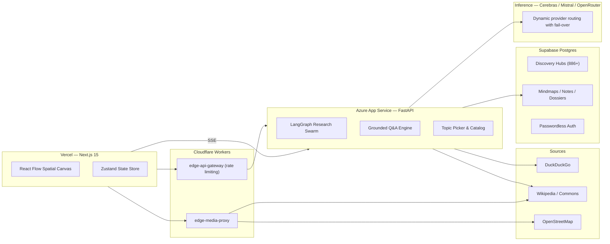

# TDILEARNED — Spatial Knowledge & Discovery Engine

> Explore any topic as an interactive spatial mindmap. Powered by Cerebras ultra-high-speed inference, a LangGraph research pipeline, and an infinite React Flow canvas.

TDILEARNED plans investigative angles, searches live web and encyclopedic records, verifies factual claims, and synthesizes a structured monograph with timelines and mechanisms — rendered as an interactive spatial knowledge graph.

**Live Application:** [https://til-seven.vercel.app](https://til-seven.vercel.app)

---

## Visual Previews

| Infinite Spatial Canvas | Research Monograph Drawer |
|:-----------------------:|:-------------------------:|
|  |  |

| Live Agent Activity Stream | Grounded Follow-up Questions |
|:--------------------------:|:----------------------------:|
|  |  |

---

## Architecture



- **Research**: a 6-stage map-reduce graph — planner decomposes the inquiry into angles, parallel workers search and verify sources, then a synthesizer writes the monograph dossier with numeric citations `[1]`, `[2]`.
- **Chat**: grounded ReAct Q&A with live citations, contextual follow-up suggestions, and answers that can be pinned onto the canvas.
- **Precomputed hubs**: 886+ fully synthesized graphs load in under 200ms with zero inference cost.
- **Storage**: two-tier cache (in-memory LRU + disk JSON) in front of Supabase Postgres.

---

## API Reference (`/api/v1`)

| Method | Endpoint | Description |
|:------:|:---------|:------------|
| `GET` | `/health` | Service health and active inference engine metadata. |
| `GET` | `/models` | Dynamic catalog of available free models. |
| `GET` | `/graph/random-topic?category=History` | Curiosity-ranked topic picker. |
| `GET` | `/graph/catalog?limit=2000` | Indexed discovery topics. |
| `GET` | `/graph/precomputed` | List of all precomputed hubs. |
| `GET` | `/graph/precomputed/{hub_id}` | Full graph payload for instant loading. |
| `GET` | `/research/stream?topic=` | **SSE**: runs the LangGraph research swarm. |
| `GET` | `/research/dossier/{node_id}` | Fetches a stored monograph dossier. |
| `GET` | `/chat/stream?node_title=&question=` | **SSE**: grounded ReAct Q&A with live citations. |

---

## Local Development

### Prerequisites
- Node.js 20+ and `npm`
- Python 3.11+ and [uv](https://docs.astral.sh/uv/)

### 1. Configure environment
```bash
git clone https://github.com/mythiipanda/til.git
cd til
cp .env.example .env.local
```
Fill in the required keys in `.env.local` (`CEREBRAS_API_KEY`, `NEXT_PUBLIC_SUPABASE_URL`, `NEXT_PUBLIC_SUPABASE_ANON_KEY`).

### 2. Start the backend
```bash
cd backend
uv sync
uv run uvicorn app.main:app --host 0.0.0.0 --port 8000 --reload
```

### 3. Start the frontend
```bash
npm install
npm run dev   # http://localhost:3000
```

---

## Production Deployment

### Backend → Azure App Service (Linux B1)
```bash
cd backend
uv export --no-dev --no-hashes --no-emit-project -o requirements.txt

az webapp up \
  --resource-group tdilearned-rg \
  --name tdilearned-backend \
  --runtime "PYTHON:3.11" \
  --sku B1 \
  --location eastus
```
Set the startup command (`uvicorn app.main:app --host 0.0.0.0 --port 8000`) and production secrets via `az webapp config`.

### Frontend → Vercel
Push to `main` auto-deploys. Vercel env: `NEXT_PUBLIC_BACKEND_URL`, `NEXT_PUBLIC_CF_PROXY_URL`, `NEXT_PUBLIC_SUPABASE_URL`, `NEXT_PUBLIC_SUPABASE_ANON_KEY`.

### Edge Proxy & API Gateway → Cloudflare Workers
```bash
cd cloudflare && npx wrangler deploy            # edge-media-proxy
cd cloudflare/api-gateway && npx wrangler deploy # edge-api-gateway (DO rate limiting + proxy)
```

---

## Verification

```bash
# Frontend static typecheck
npx tsc --noEmit

# Backend linting & type checking (from /backend)
uv run ruff check .
uv run ruff format --check .
uv run mypy app
```

---

## License

MIT License. Designed with an editorial broadsheet aesthetic.