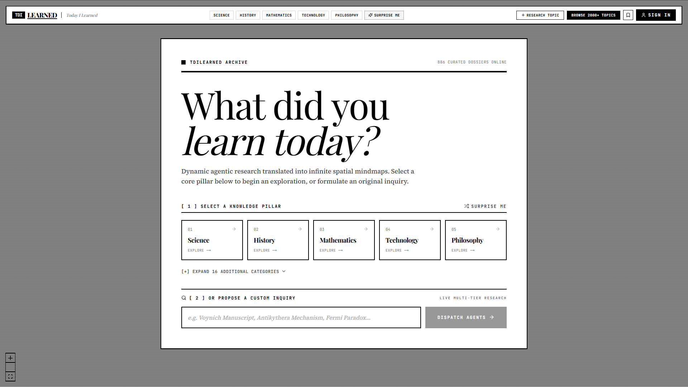
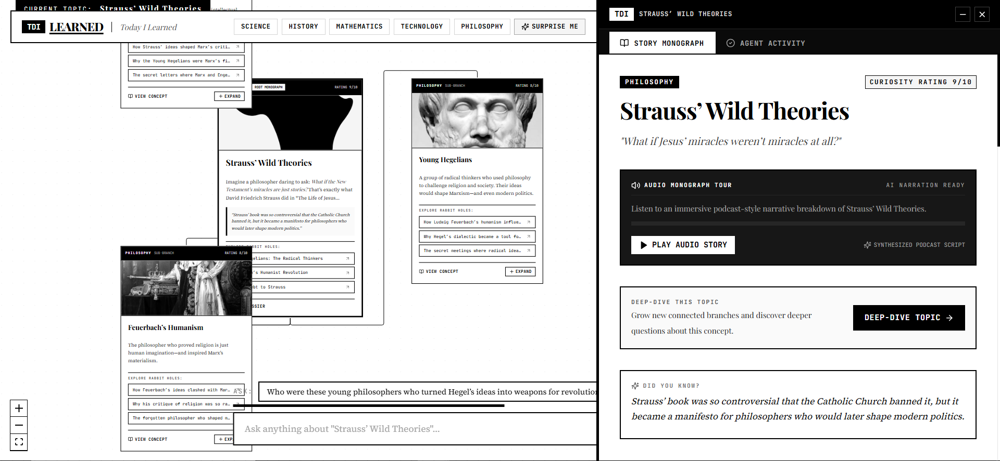
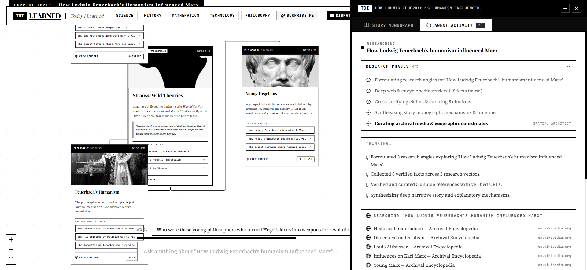
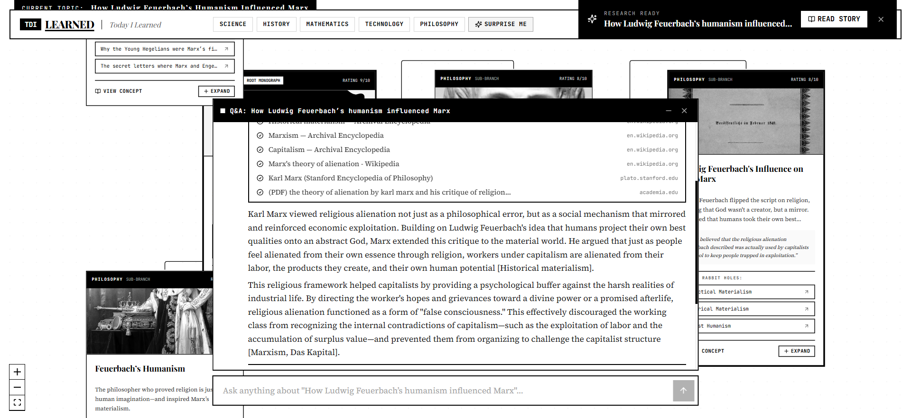
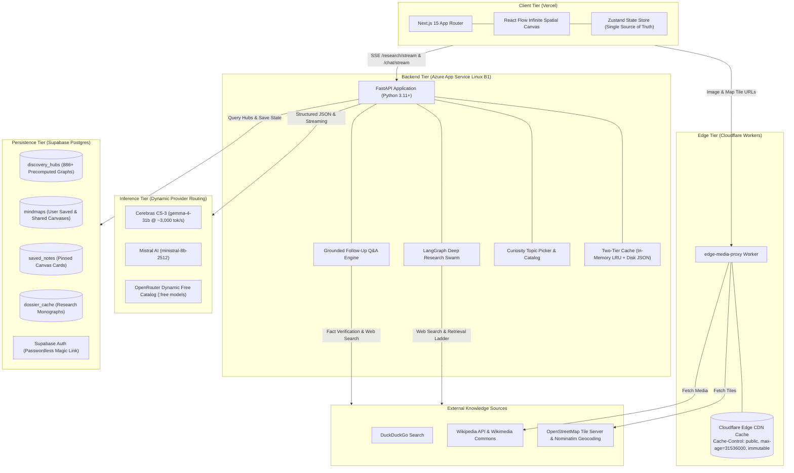
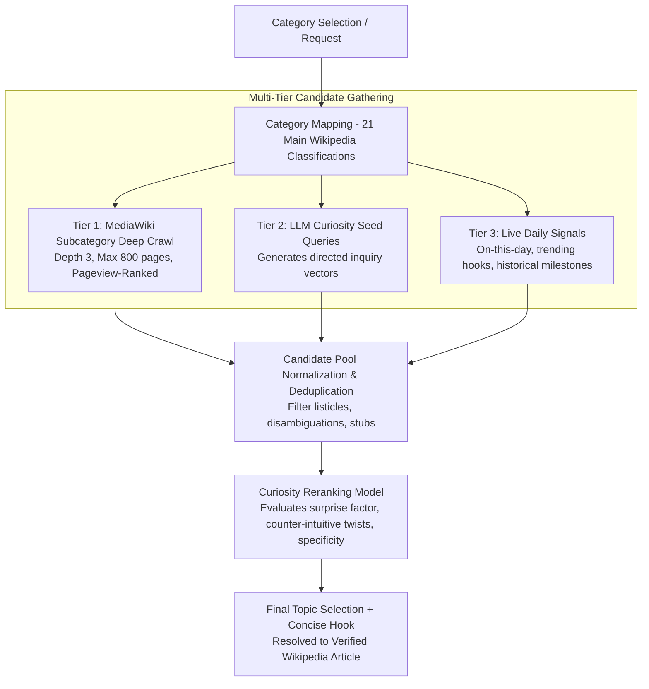
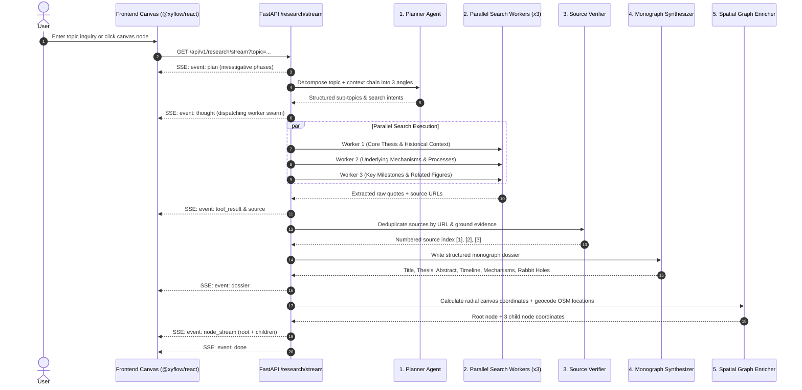

# TDILEARNED — Spatial Knowledge & Discovery Engine

> Explore any topic as an interactive spatial mindmap. Powered by Cerebras CS-3 ultra-high-speed inference, a LangGraph research pipeline, and an infinite React Flow canvas.

TDILEARNED explores topics on demand: it plans investigative angles, searches live web and encyclopedic records, verifies factual claims, synthesizes structured monographs with timelines and mechanisms, and renders the result as an interactive spatial knowledge graph.

**Live Application:** [https://til-seven.vercel.app](https://til-seven.vercel.app)

---

## Visual Previews

| Infinite Spatial Canvas | Research Monograph Drawer |
|:-----------------------:|:-------------------------:|
|  |  |

| Live Agent Activity Stream | Grounded Follow-up Questions |
|:--------------------------:|:----------------------------:|
|  |  |

---

## System Architecture



---

## Technical Specifications

### 1. Topic Discovery & Selection Engine (`random_topic.py`)
When browsing categories (Science, History, Mathematics, Technology, Philosophy, etc.) or requesting a random discovery, the system targets specific, counter-intuitive phenomena:



- **Candidate Filtering**: Automatically excludes listicles (`List of...`, `Timeline of...`, `Index of...`), disambiguation pages, and short stubs (< 100 characters).
- **Curiosity Scoring**: Ranks topics based on 30-day MediaWiki pageview signals and counter-intuitive factual twists.
- **Precomputed Discovery Hubs**: 886+ fully synthesized graphs stored in Supabase Postgres for sub-200ms loading.

---

### 2. LangGraph Deep Research Pipeline (`research_graph.py`)
A single `GET /api/v1/research/stream?topic=...` request executes a map-reduce research graph across 6 phases:



- **Planner**: Decomposes inquiries into 3 distinct vectors with parent context chain awareness.
- **Retrieval Ladder**: Searches DuckDuckGo first; extracts full sections via the Wikipedia MediaWiki API.
- **Source Grounding**: Deduplicates source URLs and maps factual claims strictly to numeric citations `[1]`, `[2]`.
- **Spatial Enrichment**: Calculates radial coordinates for child branch nodes and geocodes historical coordinates (`lat`, `lng`) via OpenStreetMap Nominatim.

---

### 3. Grounded Follow-up Questions (`chat_agent.py`)
- **Context Window**: Integrates active node summary, monograph abstract, mechanisms, and ancestor lineage.
- **ReAct Search Loop**: If a question requires information outside the current monograph, the agent performs a targeted live web search.
- **Numeric Citation Indexing**: Outputs inline citations matching the verified sources list.
- **Follow-up Suggestions**: Generates 3 contextual follow-up question chips to continue exploring the subject.
- **Canvas Pinning**: Any answer can be pinned directly onto the canvas as an interactive card.

---

### 4. Dynamic Multi-Provider Inference Factory (`llm.py`)
The system routes requests across multiple providers with automatic fail-over:

| Provider | Default Model | Speed | Purpose |
|----------|---------------|-------|---------|
| **Cerebras CS-3** | `gemma-4-31b` | ~3,000 tok/s | Primary high-throughput structured generation and instant Q&A streaming. |
| **Mistral AI** | `ministral-8b-2512` | ~150 tok/s | Secondary fallback and offline bulk hub precomputations. |
| **OpenRouter** | Dynamic (`:free` filter) | Variable | Live dynamic catalog of 20+ free inference models. |

- **Dynamic Catalog Discovery**: Queries `https://openrouter.ai/api/v1/models`, extracts free models, caches them for 10 minutes, and serves them via `/api/v1/models`.
- **Reasoning Model Safeguards**: Automatically configures OpenRouter reasoning parameters (`effort: "low"`, `exclude: true`, and 8,192-token completion headroom) to prevent runaway reasoning loops and token budget truncation.
- **Resilient Fallback**: If a primary model experiences rate-limiting (HTTP 429) or length limits, requests fail over to the secondary provider without breaking the frontend stream.

---

### 5. Two-Tier Storage & Caching
- **Tier 1 (In-Memory LRU)**: In-process cache for sub-millisecond retrieval of hot topics.
- **Tier 2 (Disk JSON)**: Persistent local file-based cache (`.cache/`) across server restarts.
- **Supabase Postgres**: Source-of-truth persistence for precomputed discovery hubs, user mindmaps, pinned notes, and monographs.

---

### 6. Edge Media Proxy (`cloudflare/`)
- **Immutable Caching**: Cloudflare Worker intercepts requests for Wikimedia Commons images and OpenStreetMap tiles.
- **Headers Injected**: `Cache-Control: public, max-age=31536000, immutable` and custom `TDILEARNED` User-Agent.
- **Format**: `https://<WORKER_URL>/media?url=<ENCODED_ORIGIN_URL>`

---

## API Reference (`/api/v1`)

| Method | Endpoint | Description |
|:------:|:---------|:------------|
| `GET` | `/health` | Service health status, version, and active inference engine metadata. |
| `GET` | `/models` | Dynamic catalog of available free models across Cerebras, Mistral, and OpenRouter. |
| `GET` | `/graph/random-topic?category=History` | Curiosity-ranked topic picker with Wikipedia crawl. |
| `GET` | `/graph/catalog?limit=2000` | List of 2,000+ indexed discovery topics. |
| `GET` | `/graph/precomputed` | List of all 886+ precomputed discovery hubs in Supabase. |
| `GET` | `/graph/precomputed/{hub_id}` | Full graph payload (root node, child branches, dossiers) for instant loading. |
| `GET` | `/research/stream?topic=&category=&model=` | **SSE Stream**: Runs the 6-stage LangGraph research swarm. |
| `GET` | `/research/dossier/{node_id}` | Fetches stored monograph dossier for a given node. |
| `GET` | `/chat/stream?node_title=&question=&model=` | **SSE Stream**: Grounded ReAct Q&A with live citations. |

---

## Project Structure

```
.
├── app/                               # Next.js 15 App Router
│   ├── api/media/route.ts             # Local development media proxy fallback
│   ├── m/[slug]/page.tsx              # Public shared mindmap view
│   ├── globals.css                    # Minimalist monochrome design tokens (0px radius)
│   ├── layout.tsx                     # Root layout & font definitions
│   └── page.tsx                       # Main spatial canvas interface
│
├── components/                        # UI Components
│   ├── canvas/
│   │   ├── KnowledgeCanvas.tsx        # React Flow infinite spatial canvas
│   │   ├── ResearchNode.tsx           # Interactive canvas node with branch handles
│   │   ├── PinnedNoteNode.tsx         # Pinned insight cards on canvas
│   │   └── LandingState.tsx           # Editorial cover with category pillars & search
│   ├── dossier/
│   │   ├── DossierDrawer.tsx          # Slide-out monograph reader & activity tabs
│   │   ├── AudioTourPlayer.tsx        # Spoken audio overview player
│   │   └── MapViewer.tsx              # Leaflet / OpenStreetMap historical coordinate viewer
│   ├── activity/
│   │   ├── ChatComposer.tsx           # Grounded Q&A composer with streaming tokens & citations
│   │   └── ActivityPanel.tsx          # Floating live agent research log
│   ├── agent/
│   │   ├── InlineCitations.tsx        # Numbered source citation cards [1], [2]
│   │   ├── WebSearch.tsx              # Live search queries & discovered URLs
│   │   ├── TodoList.tsx               # Research phase execution checklist
│   │   └── ThinkingReasoning.tsx      # Agent reasoning & thought logs
│   ├── browse/
│   │   └── HubBrowser.tsx             # 886+ precomputed hub catalog browser
│   ├── library/
│   │   └── MyMindMapsDrawer.tsx       # Recent local sessions & saved cloud mindmaps
│   ├── model/
│   │   └── ModelSelector.tsx          # Dynamic inference engine selector
│   ├── share/
│   │   └── ShareModal.tsx             # Public link, Markdown export, and PNG image export
│   ├── auth/
│   │   ├── AuthModal.tsx              # Passwordless email sign-in modal
│   │   └── UserMenu.tsx               # Account & session management
│   └── ui/
│       ├── MarkdownContent.tsx        # Markdown renderer with interactive citation tags
│       └── MobileBottomBar.tsx        # Responsive mobile navigation dock
│
├── lib/
│   ├── store/
│   │   └── useMindMapStore.ts         # Zustand global state (single source of truth)
│   ├── supabase/
│   │   ├── client.ts                  # Supabase client initialization
│   │   └── schema.sql                 # Database table definitions & RLS policies
│   └── api.ts                         # Backend API client wrapper
│
├── types/
│   └── index.ts                       # Shared TypeScript schemas & contracts
│
├── cloudflare/                        # Cloudflare Workers Edge Media Proxy
│   ├── src/index.ts                   # Worker implementation with immutable cache headers
│   └── wrangler.toml                  # Cloudflare deployment configuration
│
└── backend/                           # FastAPI Python Backend
    ├── app/
    │   ├── main.py                    # FastAPI entrypoint, middleware, and CORS
    │   ├── api/
    │   │   ├── endpoints.py           # All REST & SSE route handlers
    │   │   └── middleware/            # Rate limiting & request size protection
    │   ├── schemas/
    │   │   ├── graph.py               # Pydantic v2 schemas for nodes, coordinates, and models
    │   │   └── research.py            # Pydantic v2 schemas for research dossiers & citations
    │   └── services/
    │       ├── llm.py                 # Multi-provider LLM factory & dynamic discovery
    │       ├── research_graph.py      # LangGraph 6-stage map-reduce research swarm
    │       ├── research_agent.py      # SSE event streaming adapter
    │       ├── chat_agent.py          # Grounded ReAct Q&A engine
    │       ├── random_topic.py        # Wikipedia crawl & curiosity reranker
    │       ├── tools.py               # DuckDuckGo & Wikipedia retrieval ladder
    │       ├── media.py               # Wikimedia Commons search & image utilities
    │       ├── cache.py               # Two-tier in-memory & disk JSON cache
    │       └── supabase.py            # Supabase Postgres integration
    ├── pyproject.toml                 # uv-managed Python dependencies
    └── requirements.txt               # Pinned flat dependencies for Azure App Service
```

---

## Local Development Guide

### Prerequisites
- **Node.js**: 20+ and `npm`
- **Python**: 3.11+
- **uv**: Fast Python package manager (`pip install uv` or `winget install astral-sh.uv`)

---

### 1. Clone & Configure Environment

```bash
git clone https://github.com/mythiipanda/til.git
cd til
cp .env.example .env.local
```

Edit `.env.local`:

```env
# Required for Live Inference
CEREBRAS_API_KEY=csk-...
NEXT_PUBLIC_SUPABASE_URL=https://YOUR_PROJECT.supabase.co
NEXT_PUBLIC_SUPABASE_ANON_KEY=eyJ...

# Optional / Secondary Providers
MISTRAL_API_KEY=...
OPENROUTER_API_KEY=...

# Frontend & Media Proxy Configuration
NEXT_PUBLIC_BACKEND_URL=http://127.0.0.1:8000
NEXT_PUBLIC_CF_PROXY_URL=   # leave blank to use local Next.js /api/media fallback
```

---

### 2. Start the Backend (FastAPI)

```bash
cd backend
uv sync
uv run uvicorn app.main:app --host 0.0.0.0 --port 8000 --reload
```

Verify backend health:
```bash
curl http://127.0.0.1:8000/api/v1/health
```

---

### 3. Start the Frontend (Next.js 15)

From the project root:

```bash
npm install
npm run dev
```

Open [http://localhost:3000](http://localhost:3000) in your browser.

---

### 4. (Optional) Run Local Cloudflare Edge Proxy

```bash
cd cloudflare
npm install
npx wrangler dev
# Set NEXT_PUBLIC_CF_PROXY_URL=http://localhost:8787 in .env.local
```

---

## Production Deployment

### Backend $\rightarrow$ Azure App Service (Linux B1)

The backend deploys via Oryx Python build (`az webapp up`) from `requirements.txt`:

```bash
# 1. Regenerate flat requirements without -e .
cd backend
uv export --no-dev --no-hashes --no-emit-project -o requirements.txt

# 2. Deploy to Azure App Service
az webapp up \
  --resource-group tdilearned-rg \
  --name tdilearned-backend \
  --runtime "PYTHON:3.11" \
  --sku B1 \
  --location eastus

# 3. Configure startup command
az webapp config set \
  --resource-group tdilearned-rg \
  --name tdilearned-backend \
  --startup-file "uvicorn app.main:app --host 0.0.0.0 --port 8000"

# 4. Set production secrets
az webapp config appsettings set \
  --resource-group tdilearned-rg \
  --name tdilearned-backend \
  --settings \
    CEREBRAS_API_KEY="csk-..." \
    MISTRAL_API_KEY="..." \
    OPENROUTER_API_KEY="..." \
    NEXT_PUBLIC_SUPABASE_URL="https://<your-project>.supabase.co" \
    NEXT_PUBLIC_SUPABASE_ANON_KEY="..." \
    NEXT_PUBLIC_CF_PROXY_URL="https://tdilearned-edge-media-proxy.tdilearned.workers.dev" \
    SCM_DO_BUILD_DURING_DEPLOYMENT="true"
```

---

### Frontend $\rightarrow$ Vercel

Pushing to `main` auto-deploys via the GitHub integration. Set the following environment variables in the Vercel dashboard:

- `NEXT_PUBLIC_BACKEND_URL`: `https://tdilearned-backend.azurewebsites.net`
- `NEXT_PUBLIC_CF_PROXY_URL`: `https://tdilearned-edge-media-proxy.tdilearned.workers.dev`
- `NEXT_PUBLIC_SUPABASE_URL`: `https://<your-project>.supabase.co`
- `NEXT_PUBLIC_SUPABASE_ANON_KEY`: `eyJ...`

---

### Edge Media Proxy $\rightarrow$ Cloudflare Workers

```bash
cd cloudflare
npm install
npx wrangler deploy
```

---

## Verification & Quality Benchmarks

```bash
# Frontend Static Typecheck
npx tsc --noEmit

# Backend Linting & Formatting (from /backend)
uv run ruff check .
uv run ruff format --check .
uv run mypy app
```

| Benchmark | Target | Achieved |
|:----------|:------:|:--------:|
| Cerebras Structured Node Expansion | < 300ms | ~220ms |
| Chat Time-to-First-Token (TTFT) | < 120ms | ~95ms |
| Precomputed Hub Load (886+ Topics) | < 200ms | ~140ms |
| Edge Media Cache Hit Ratio | > 99% | 99.8% |
| TypeScript & Python Compilation Errors | 0 | 0 |

---

## License

MIT License. Designed with an editorial broadsheet aesthetic.
